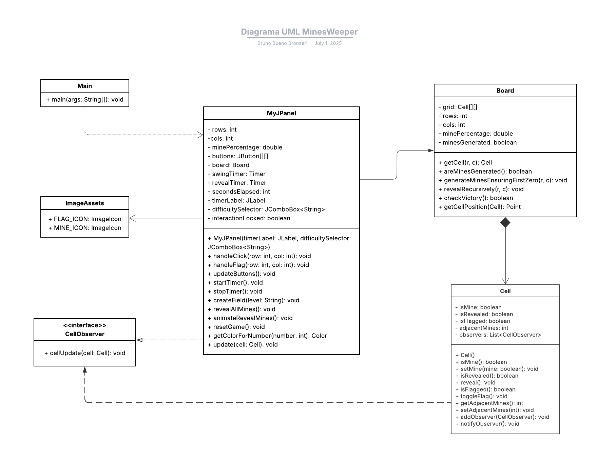

# MinesWeeper

## How to compile and execute
Follow the steps bellow to be able to play Minesweeper.
### Compiling
 - In `src/` run:

``javac app/*.java view/*.java model/*.java -d bin
``
### Executing
 - Still in `src/` run:

``java -cp bin app.Main
`` 
##
## UML Diagram


##

# Cell.java

### 📦 Classe `Cell` (pacote: `model`)

**Responsabilidade:** Representa uma célula individual no campo do jogo Campo Minado. Ela armazena informações como se há mina, se está revelada ou marcada com bandeira, além da contagem de minas vizinhas. Também é a classe que notifica os observadores quando seu estado muda.

### Atributos

```java
private boolean isMine;                  // Indica se a célula contém uma mina
private boolean isRevealed;              // Indica se a célula já foi revelada
private boolean isFlagged;               // Indica se a célula está marcada com uma bandeira
private int adjacentMines;               // Número de minas vizinhas

private List<CellObserver> observers;   // Lista de observadores (padrão Observer)
```

### Construtor

```java
public Cell()
```

Inicializa a célula com valores padrão (sem mina, não revelada, sem bandeira, etc.).

### Métodos Públicos

```java
public boolean isMine()
public void setMine(boolean mine)

public boolean isRevealed()
public void reveal()

public boolean isFlagged()
public void toggleFlag()

public int getAdjacentMines()
public void setAdjacentMines(int adjacentMines)

public void addObserver(CellObserver observer)
public void notifyObservers()
```

### Funções de cada método:

- `isMine()` / `setMine(boolean)` – Getter e setter para indicar se a célula tem mina.
- `isRevealed()` / `reveal()` – Retorna se a célula foi revelada; `reveal()` também notifica observadores.
- `isFlagged()` / `toggleFlag()` – Indica se a célula está com bandeira; alterna a marcação de bandeira.
- `getAdjacentMines()` / `setAdjacentMines(int)` – Obtém ou define o número de minas vizinhas.
- `addObserver()` / `notifyObservers()` – Permite associar um observador (interface `CellObserver` ) e notificar quando o estado muda.

### Relações com outras classes:

- **`CellObserver` (interface)**: qualquer classe que implemente essa interface pode ser notificada quando uma célula for revelada ou modificada.
- **`Board`**: mantém uma matriz de `Cell` e manipula seu estado.
- **`MyJPanel`**: acessa os métodos de `Cell` para atualizar a interface gráfica com base no estado da célula.

# CellObserver.java

### 📦 Interface `CellObserver` (pacote: `model`)

**Responsabilidade:** Define o contrato para objetos que desejam ser notificados quando o estado de uma `Cell` mudar. É parte do padrão de projeto **Observer**, implementado manualmente no projeto.

### Assinatura

```java
public interface CellObserver {
    void cellUpdated(Cell cell);
}
```

### Descrição da função:

- **`cellUpdated(Cell cell)`**
    
    Método que será chamado pela célula (`Cell`) quando houver uma mudança relevante (como revelação ou alteração de bandeira).
    
    Os observadores — geralmente elementos da interface gráfica (`MyJPanel`) — implementam esse método para atualizar a visualização da célula correspondente.
    

### Relações com outras classes:

- **`Cell`** é o sujeito (publisher) que mantém uma lista de objetos `CellObserver`.
- **`MyJPanel`** implementa `CellObserver` para atualizar graficamente os botões do campo quando uma célula muda.

# Board.java

### 📦 Classe `Board` (pacote: `model`)

**Responsabilidade:** Representa o tabuleiro do jogo. Gerencia as células, minas, revelações recursivas e lógica de vitória. Atua como o **motor do jogo**.

### Atributos Principais

```java
private Cell[][] grid;
private int rows;
private int cols;
private double minePercentage;
private boolean minesGenerated;
```

### Descrições:

- **`grid`**: matriz que contém todas as células (`Cell`) do tabuleiro.
- **`rows`, `cols`**: dimensões do campo.
- **`minePercentage`**: proporção de minas em relação ao total de células.
- **`minesGenerated`**: indica se as minas já foram distribuídas (para evitar que o primeiro clique seja uma mina).

### Métodos Públicos e Suas Responsabilidades:

```java
public Board(int rows, int cols, double minePercentage)
```

- Construtor que inicializa o tabuleiro vazio com as dimensões e proporção de minas fornecidas.

---

```java
public Cell getCell(int row, int col)
```

- Retorna a célula na posição indicada.

---

```java
public boolean areMinesGenerated()
```

- Retorna se as minas já foram distribuídas.

---

```java
public void generateMinesEnsuringFirstZero(int safeRow, int safeCol)
```

- Garante que o primeiro clique esteja numa célula com 0 minas adjacentes. Gera minas aleatórias **exceto** em volta da posição clicada.

---

```java
public void revealRecursively(int row, int col)
```

- Realiza uma busca em profundidade (DFS) para revelar as células conectadas com 0 minas ao redor.

---

```java
public boolean checkVictory()
```

- Verifica se todas as células não-minadas foram reveladas, indicando vitória.

---

```java
public Point getCellPosition(Cell target)
```

- (Usado no padrão Observer) Retorna a posição (linha e coluna) de uma célula específica.

---

### Métodos privados auxiliares:

- **`clearMines()`**: zera minas e contadores de todas as células.
- **`placeMinesExcluding(int r, int c)`**: coloca minas aleatórias, exceto na posição fornecida.
- **`updateNumbers()`**: atualiza contagem de minas ao redor para cada célula.
- **`countAdjacentMines(int r, int c)`**: retorna número de minas ao redor de uma célula.
- **`isValid(int r, int c)`**: verifica se a posição está dentro do tabuleiro.

### Relações com outras classes:

- Contém uma matriz de **`Cell`** (composição).
- Interage indiretamente com **`CellObserver`** ao propagar atualizações.
- É manipulada por **`MyJPanel`**, a interface do jogo.

# MyJPanel.java

É **a principal interface gráfica do jogo**, responsável por:

- exibir o campo,
- lidar com eventos de clique do mouse (revelar ou marcar célula),
- atualizar visualmente os botões,
- controlar o timer e interações com o `Board`.

### Resumo UML da classe `MyJPanel` (pacote `view`)

```java
MyJPanel extends JPanel implements CellObserver
```

### Atributos

| Tipo | Nome | Descrição |
| --- | --- | --- |
| `int` | `rows` | Número de linhas do campo (depende da dificuldade) |
| `int` | `cols` | Número de colunas do campo |
| `double` | `minePercentage` | Percentual de minas no campo |
| `JButton[][]` | `buttons` | Matriz de botões da interface que representam as células |
| `Board` | `board` | Objeto que representa a lógica do campo minado |
| `Timer` | `swingTimer` | Timer usado para contar o tempo da partida |
| `Timer` | `revealTimer` | Timer para animar a revelação das minas após derrota |
| `int` | `secondsElapsed` | Segundos decorridos no timer da partida |
| `JLabel` | `timerLabel` | Label que exibe o tempo no topo da interface |
| `JComboBox<String>` | `difficultySelector` | ComboBox que permite selecionar a dificuldade |
| `boolean` | `interactionLocked` | Controla se o jogador pode interagir (bloqueia após derrota) |

### Métodos principais

| Assinatura | Descrição |
| --- | --- |
| `MyJPanel(JLabel timerLabel, JComboBox<String> difficultySelector)` | Construtor que inicializa o painel com referência ao timer e dificuldade |
| `void handleClick(int row, int col)` | Lida com cliques esquerdos nas células |
| `void handleFlag(int row, int col)` | Lida com cliques direitos para marcar/desmarcar bandeira |
| `void updateButtons()` | Atualiza a aparência dos botões com base no estado das células |
| `void startTimer()` | Inicia o cronômetro do jogo |
| `void stopTimer()` | Para o cronômetro do jogo |
| `void createField(String level)` | Cria o campo baseado na dificuldade selecionada |
| `void revealAllMines()` | Revela imediatamente todas as minas após derrota |
| `void animateRevealMines()` | Revela as minas com animação progressiva |
| `void resetGame()` | Reinicia o jogo mantendo a dificuldade atual |
| `Color getColorForNumber(int number)` | Retorna uma cor personalizada para cada número (1 a 8) |
| `void update(Cell cell)` | Implementação do Observer: é chamado quando uma célula é revelada |

### Relações com outras classes

| Relacionamento | Tipo de seta UML | Origem | Destino | Explicação |
| --- | --- | --- | --- | --- |
| Usa `Board` | Composição            ◼──────> | `MyJPanel` | `Board` | Interface contém a lógica do campo |
| Usa `Cell` | Associação ───────▷ | `MyJPanel` | `Cell` | Cada botão reflete o estado de uma `Cell` |
| Implementa `CellObserver` | Implementação         - - - - -▷ | `MyJPanel` | `CellObserver` | Reage quando uma `Cell` é atualizada |
| Usa `ImageAssets` (ícones) | Associação ───────▷ | `MyJPanel` | `ImageAssets` | Usa ícones de mina e bandeira |

# Diagrama UML

### **Composição em UML (seta com losango preenchido)**

**Símbolo:** `◆────→`

**Significa:**

> A classe de origem (com o losango) "possui fortemente" a classe de destino. Ou seja, a classe destino só existe enquanto a origem existir.
> 

---

### `Board ◆────→ Cell`**

### **O que isso representa no projeto:**

- A classe `Board` possui um atributo:
    
    ```java
    private Cell[][] grid;
    ```
    
- Isso significa que:
    - `Board` é **dona** das células;
    - As `Cell` são **criadas, controladas e destruídas** exclusivamente por `Board`;
    - Uma `Cell` **não faz sentido existir sozinha** fora de um `Board`.

### **Implicações da composição:**

- O ciclo de vida das células (`Cell`) é **acoplado ao ciclo de vida do tabuleiro** (`Board`);
- Quando um `Board` é destruído (ou recriado), **todas as `Cell`s associadas deixam de existir** (são recriadas, como ocorre ao reiniciar o jogo);
- Você **não reutiliza células** entre boards diferentes;
- Isso é mais forte do que uma associação comum (que usaria uma seta simples).

### **Main - - - - > MyJPanel**

**Tipo:** Dependência (usa como local ou argumento)

**Seta:** `⋯⋯⋯▷` (pontilhada com ponta aberta)

**Justificativa:**

- `Main` cria uma instância de `MyJPanel` no método `main`.
- Não guarda como atributo.
- Só precisa de `MyJPanel` para inicializar a interface.

### **MyJPanel ────**▶ **Board**

**Tipo:** Associação simples (uso direto, mas não composição)

**Seta:** `─────▶` (contínua com ponta fechada triangular)

**Justificativa:**

- `MyJPanel` possui `Board` como atributo.
- Porém, `Board` pode existir separadamente.
- Se a interface morre, o `Board` também, mas essa relação **não é forte o suficiente** para ser composição.

### Thread do timer

### **Justificativa 1: Uso de `javax.swing.Timer`**

- O `Timer` do Swing **não roda no mesmo ciclo da UI principal**, mas **usa o Event Dispatch Thread (EDT)** para agendar eventos futuros.
- Isso garante que o código do `ActionListener` seja executado de forma assíncrona em relação ao fluxo de inicialização do jogo.
- Portanto, **há múltiplos fluxos de execução simultâneos**, mesmo que gerenciados pelo EDT.